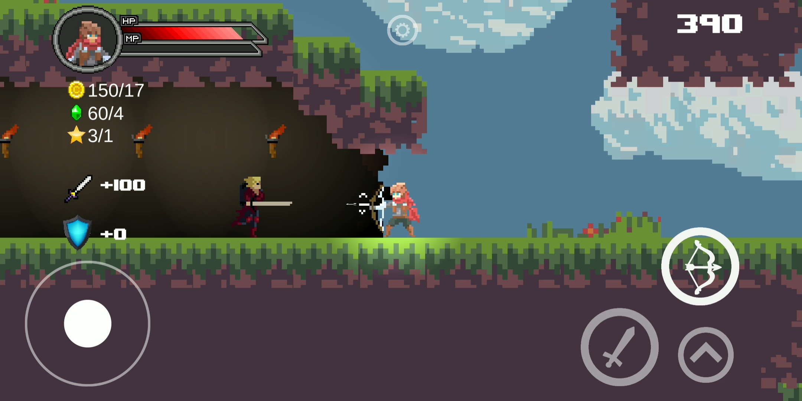
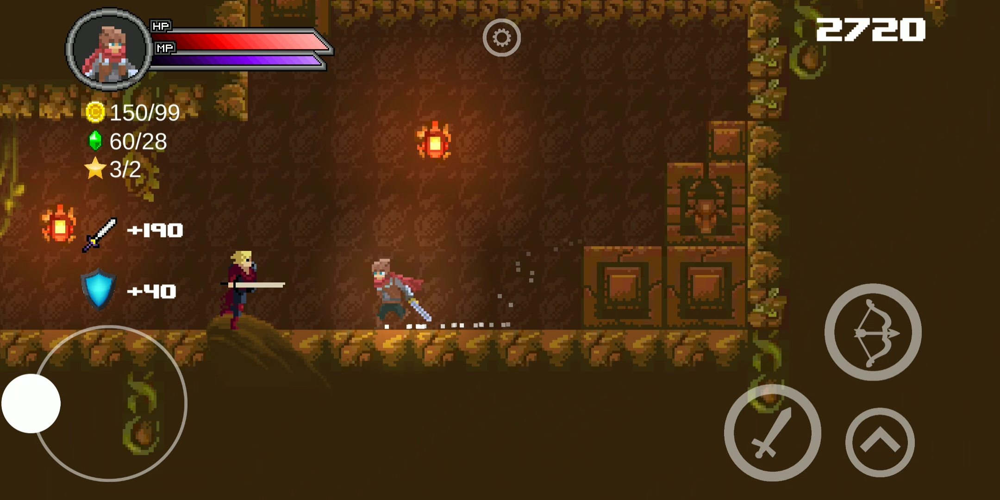
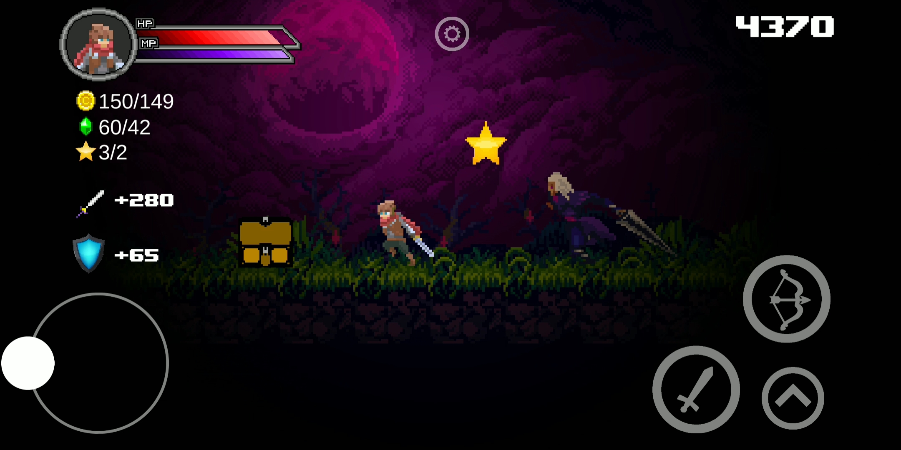
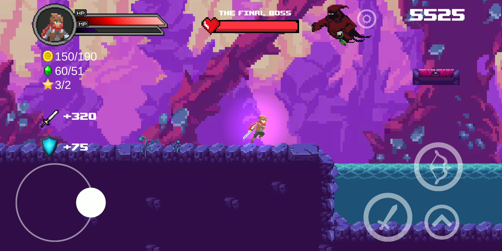

# Kailius
In Kailius, players embark on an exhilarating adventure through a captivating 2D platforming world. Developed using Unity, this engrossing game is available for Android, Windows, and Linux platforms, allowing gamers to immerse themselves in its enchanting universe on their preferred devices.

Set in a realm brimming with excitement and challenges, Kailius offers a test of skill for players of all levels. With its diverse range of levels, the game keeps you engaged as the difficulty steadily increases, ensuring a thrilling experience from start to finish. Each level presents unique obstacles and puzzles that demand precise timing, nimble movements, and quick thinking to overcome.

Drawing inspiration from the pixelated aesthetics of classic 8-bit RPGs, Kailius presents a nostalgic visual style that resonates with fans of retro gaming. The carefully crafted PixelArt graphics breathe life into the game's characters, environments, and enemies, transporting players back to the golden era of gaming while still offering a fresh and modern experience.

Whether you're a seasoned platforming enthusiast or a newcomer to the genre, Kailius promises hours of entertainment, challenges, and triumphs. Are you ready to embark on this epic journey and become a legend in the realm of Kailius? The fate of this captivating world lies in your hands.

## :warning: Requirements
* Android 5.0+
* Snapdragon 625+
* 2GB RAM

## :iphone: [Play Store](https://play.google.com/store/apps/details?id=com.waniapps.Kailius.game.android)

