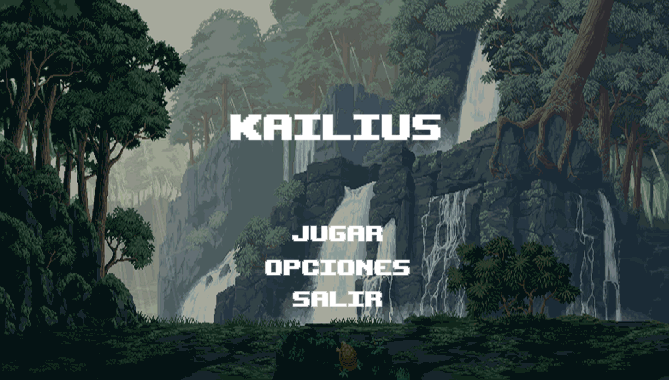

# Kailius
Platform Game 2D developed in Unity for Android, Windows and Linux.

Kailius is a very entertaining game in which you test your skill. Kailius has many levels in which the difficulty increases and two main missions that increase the score if they are completed.

Kailius is based on the first RPGs with PixelArt aesthetics (8 Bits).
## :warning: Requirements
* Android 5.0+
* Snapdragon 625+
* 2GB RAM

## :iphone: [Play Store](https://play.google.com/store/apps/details?id=com.waniapps.Kailius.game.android)

